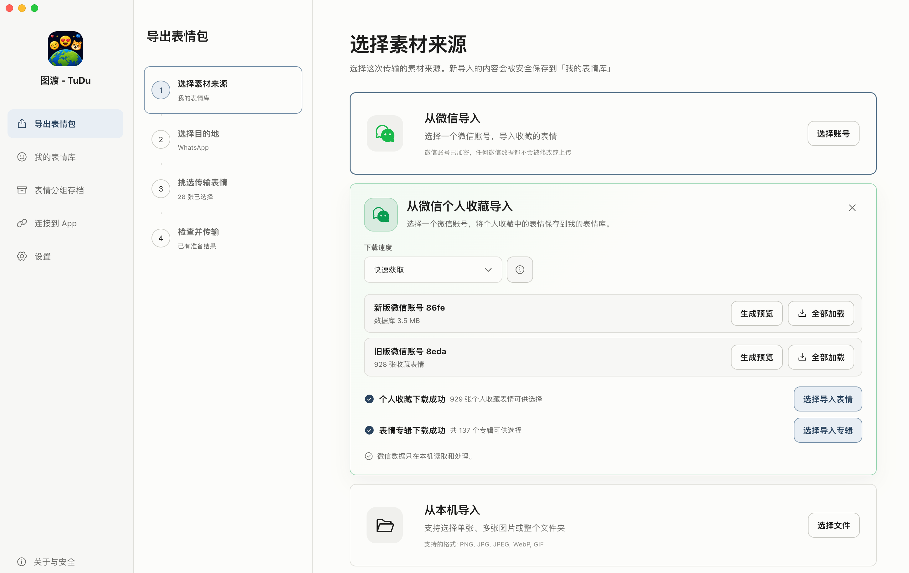

# 图渡

让中文互联网的表情包跟着你一起出海。

图渡 - Tudu 是一款 macOS 端桌面应用，可以从微信导出表情，整理成自己的素材库，再发送到 WhatsApp 或导出到本地文件夹。

> Helping Chinese memes travel abroad — from WeChat to WhatsApp, and more.



## 功能

- 从微信导入个人收藏表情和已收藏的官方表情专辑（有 vx 版本要求）。
- 从本机图片或文件夹导入素材。
- 预览、搜索、筛选、排序和批量管理静态或动态表情。
- 准备符合 WhatsApp 要求的 sticker pack（WhatsApp 标准下的表情包分享格式），并发送到 WhatsApp。
- 将选择的表情导出到本地文件夹，或保存为可再次使用的分组存档。

## 隐私与网络访问

- 素材整理、转换、素材库存储和本地导出均在本机完成。
- 不会修改 vx 原始数据库或源图片。
- vx 数据库访问凭证和 WhatsApp 登录凭证保存在本机。
- 连接 WhatsApp、手动安装插件以及检查 GitHub Release 更新时会访问对应的网络服务。

请只处理属于你自己的账号和数据，并遵守所在地法律及相关平台条款。

## 系统要求

- macOS 13 Ventura 或更高版本。
- Apple Silicon Mac；Intel Mac 当前标记为 Beta。
- 源码构建需要 Node.js 20.9 或更高版本及 npm。

## 从源码运行

```sh
npm ci
npm run dev
```

完整检查：

```sh
npm run typecheck
npm test
npm run lint
npm run format:check
npm run build
```

构建未签名的 Community 包：

```sh
npm run package:mac:community:arm64
npm run package:mac:community:x64
```

输出位于 `release/community/`。项目不提供 macOS 签名和公证；首次打开未签名构建时，macOS 可能显示安全提示。

## 下载与更新

正式安装包通过本仓库的 GitHub Releases 发布。应用只检测并提醒新版本，不会自动下载或安装应用更新。

## 项目关系声明

图渡是非官方独立工具，图渡内可以连接到的 App 来自各大互联网公司，作者与这些公司没有任何从属关系、利益冲突。图渡也未获得这些公司的认可或授权。

由于一些限制，本 community 版本不提供任何与表情包来源应用相关的源码。本应用仅供个人学习交流使用，任何使用本应用产生的后果与作者无关。

## License

公开应用源码使用 [GNU General Public License v3.0](LICENSE)。第三方组件及其许可证见 [THIRD_PARTY_NOTICES.md](THIRD_PARTY_NOTICES.md)。
